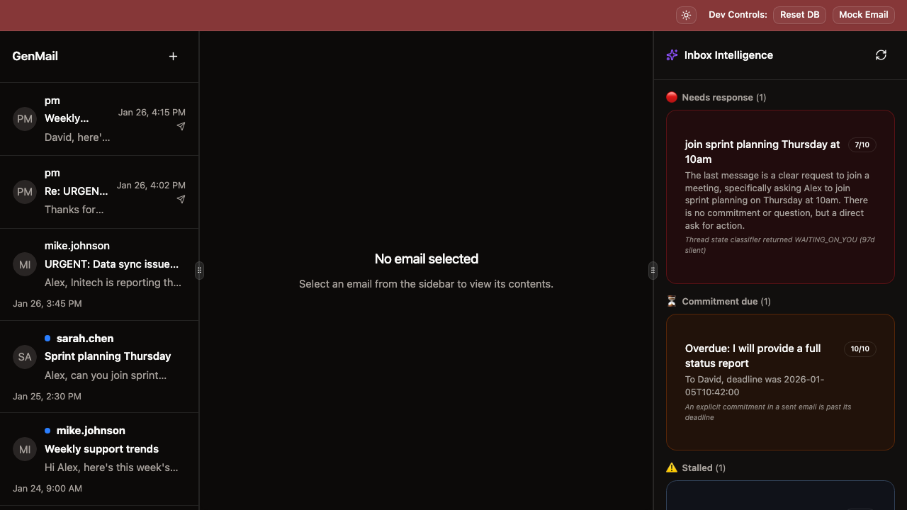
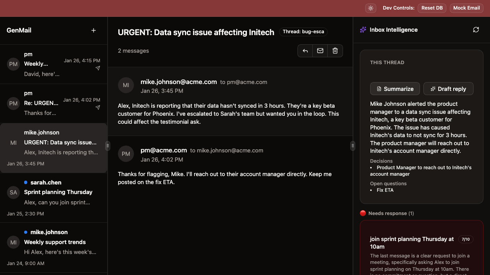
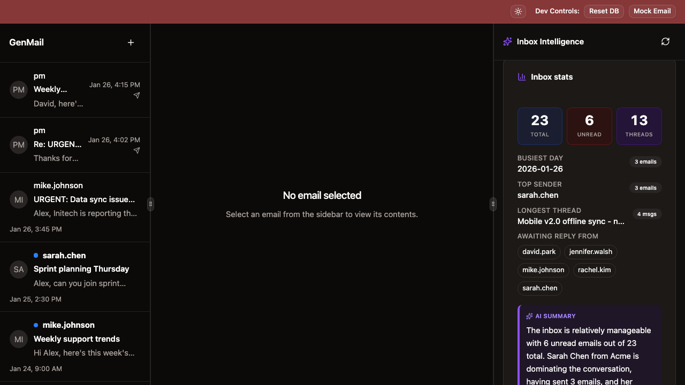
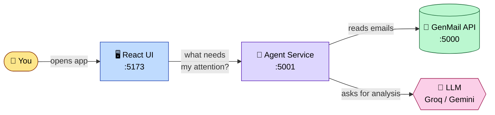

# GenMail

**An AI assistant for your inbox that tells you what actually needs your attention.**

Open your email client. 30 unread messages. 5 active threads. Some labelled URGENT. Some ghosted weeks ago. Where do you start?

GenMail reads every email you have, and then surfaces the things you'd otherwise miss — overdue commitments, stalled threads, urgent customer issues — ranked by how much they actually matter.



---

## What it does

GenMail's "Inbox Intelligence" panel groups everything that needs your attention into three clear buckets:

- 🔴 **Needs response** — *"Mike's Initech sync issue is genuinely urgent — customer impact, mentions a key beta customer, sender rarely escalates."*
- ⏳ **Commitment due** — *"You promised David a status report by Friday. Friday was 3 days ago."*
- ⚠️ **Stalled** — *"Jennifer said she'd send the Globex requirements doc 'tomorrow.' That was 13 days ago."*

Each item shows a score, a one-line reason, and the underlying email — so you can trust the AI without having to take its word for it.

It also handles per-thread tasks on demand:
- 📝 **Summarize** any conversation in 2-3 sentences with extracted decisions and open questions
- ✍️ **Draft replies** in your own writing voice (learned from past sent emails)

Below the proactive buckets, an expandable **"More insights"** section adds two more tools:

- 📊 **Inbox stats** — total / unread / thread counts, busiest day, top sender, longest thread, who you're awaiting replies from, plus an AI-written one-paragraph "what stands out" summary
- 🔍 **Cross-thread synthesis** — type a topic ("Phoenix", "Initech") and the agent stitches every relevant thread into a coherent report: current status, timeline, decisions, blockers, and people involved

## See it in action





Click any email → the panel shows you the thread summary, key decisions, and open questions instantly.

---

## How it works (30-second version)



**When you open the app, three things happen behind the scenes:**

1. The web UI asks the AI agent: *"what needs my attention?"*
2. The agent fetches every email from the email server, then runs about 14 small AI tasks in parallel — urgency scoring, commitment extraction, thread state classification.
3. It ranks all the signals using an explicit rubric (overdue commitments first, then urgent unread, then long-stalled threads), dedupes, and sends back a clean prioritized list.

That's it. The whole "AI brain" is a separate service that talks to the email app over a simple HTTP API — so each piece can be developed, tested, and swapped independently.

---

## Try it yourself

You'll need three terminals. From the `genmail_starter/` directory:

**Terminal 1 — email server**
```bash
cd server
uv venv && source .venv/bin/activate
uv pip install -e .
python main.py                 # → http://localhost:5000
curl -X POST localhost:5000/reset   # seed 23 demo emails
```

**Terminal 2 — AI agent**
```bash
cd agent_service
uv venv && source .venv/bin/activate
uv pip install -e ".[dev]"
cp .env.example .env
# Edit .env and paste a free Groq API key from https://console.groq.com
uv run uvicorn app:app --port 5001 --reload   # → http://localhost:5001
```

**Terminal 3 — web UI**
```bash
cd client
npm install --registry https://registry.npmjs.org
npm run dev                    # → http://localhost:5173
```

Open `http://localhost:5173` and watch the Inbox Intelligence panel populate.

---

## Quality numbers

Every classifier was run against hand-labeled ground truth. Run it yourself with `cd agent_service && uv run python -m evals.run_evals`:

| Feature | Precision | Recall | F1 |
|---------|-----------|--------|-----|
| Thread state classifier | 1.00 | 1.00 | **1.00** |
| Urgency classifier | 1.00 | 1.00 | **1.00** |
| Commitment extractor | 1.00 | 0.75 | **0.86** |
| Cross-thread relevance | 0.73 | 0.92 | **0.81** |

These numbers come from a free LLM (Groq's Llama-4-Scout). Same code with a paid model would push them higher.

Full results and per-feature notes: [`agent_service/evals/results/latest.md`](agent_service/evals/results/latest.md).

---

## Built with

**Backend**


**AI / LLM**


**Frontend**


**Quality / Evals**
-22C55E?style=for-the-badge&logo=checkmarx&logoColor=white)


**Tooling**


---

<details>
<summary><b>Under the hood — the longer story</b></summary>

### The 10 features

| # | Feature | What it does |
|---|---------|--------------|
| F1 | Thread Summarizer | 2-3 sentence summary + decisions + open questions |
| F2 | Unread Digest | Per-sender bullets across unread mail, with action items aggregated |
| F3 | Sender Topic Analysis | Topic clusters across all emails from one sender |
| F4 | Stats Dashboard | Inbox metrics (busiest day, longest thread, awaiting reply) + LLM-written narrative |
| F5 | Commitment Tracker | Extracts every promise you made, with status (OPEN / OVERDUE / DONE) |
| F6 | Urgency Classifier | 1-10 score + label + reasoning for any email |
| F7 | Thread State | One of 6 states (ACTIVE / WAITING_ON_YOU / WAITING_ON_THEM / BLOCKED / RESOLVED / FYI) |
| F8 | Smart Reply Drafter | Drafts replies in the user's voice, learned from past sent emails |
| F9 | Proactive Surface | LangGraph orchestrator that combines F5+F6+F7 into the prioritized panel |
| F10 | Cross-Thread Synthesizer | Stitches multiple threads about one topic into a coherent timeline + decisions + blockers |

### Architecture decisions

- **Three separate services** instead of one monolith. The email API stays clean and reusable; the AI logic is isolated for testing/eval; each can be deployed independently. The boundaries cost nothing to draw and pay back tenfold in clarity.
- **One LLM facade** (`llm/__init__.py`). Every agent calls one function. Provider swap (Gemini → Groq → Ollama) is a single env var, no agent code touched.
- **Hybrid Python + LLM** wherever possible. F4 Stats counts in Python (deterministic, free) and only uses the LLM for the narrative paragraph. F5 Commitments resolves OVERDUE status in Python from an LLM-extracted date.
- **Two-pass extraction for commitments.** Pass 1 catches every candidate (recall-biased, strong model). Pass 2 verifies each one (precision-biased, cheap model) and rejects placeholders, status reports, and possibilities.
- **Speech-act intermediates for thread state.** The LLM extracts `(who_spoke_last, last_speech_act, action_awaited)`. A deterministic Python decision table maps that to the final state. More reliable than asking the LLM to pick the state directly.
- **LangGraph for the proactive orchestrator.** The state machine (gather signals → rank → format) makes the dataflow explicit and easy to swap nodes for evals.
- **Every LLM call is logged** to `logs.db` with prompt, response, latency, tokens, errors. Hit `GET /admin/logs` for live debugging during a demo.

### Failure cases caught and fixed

The README's quality numbers are after two iteration rounds against ground truth. Real failures we caught:

- **The "RECIPIENT" placeholder.** Llama-4-Scout copied the literal word `RECIPIENT` from the prompt template into its commitment output. → Two-pass verifier rejects it.
- **Stale ≠ Blocked.** First version of F7 classified all 5 silent threads as BLOCKED because the seed data is months old. → Switched to speech-act intermediates so "user owes a reply" stays WAITING_ON_YOU regardless of how long it's been silent.
- **Status reports as commitments.** The extractor pulled "Phoenix on track for April 15" and "Provide updates on…" from a status email. → Verifier prompt explicitly rejects status-reporting language.
- **Binary urgency.** Free Llama hit either HIGH or LOW with nothing in between. → Added 4-bucket calibration with concrete examples for MEDIUM. Precision/recall on HIGH+CRITICAL went 0.50/1.00 → 1.00/1.00.

### Tech stack

| Layer | Choice | Why |
|-------|--------|-----|
| Email server | Flask + SQLite | The starter app's existing stack — left untouched |
| Agent service | FastAPI + httpx + Pydantic | Async-native (parallel LLM calls), built-in OpenAPI, type-safe outputs |
| LLM | Groq (Llama-4-Scout) | Fast, free, supports JSON-schema constrained decoding |
| Orchestration | LangGraph | State machine for the proactive feature |
| UI | React 19 + Vite + shadcn/ui + Tailwind 4 | Modern + low-bundle + reusable design system |
| Eval harness | hand-labeled JSON + Python | Reproducible numbers anyone can re-run |

### File layout

```
genmail_starter/
├── README.md                    ← you are here
├── server/                      ← email API (Flask + SQLite, unchanged)
├── agent_service/               ← AI brain (FastAPI, all new)
│   ├── llm/                     ← provider facade + Groq/Gemini/Ollama backends
│   ├── prompts/                 ← one file per feature, plain text templates
│   ├── agents/                  ← business logic per feature
│   ├── evals/                   ← ground truth + harness + results
│   └── tests/
└── client/                      ← React UI (existing app + new InboxIntelligence panel)
    └── src/components/InboxIntelligence.tsx   ← the new side panel
```

### Switching LLM providers

The agent service supports three providers via the `LLM_PROVIDER` env var. No agent code changes — they all conform to the same `complete()` facade.

```env
LLM_PROVIDER=groq      # free, fast (default — recommended)
LLM_PROVIDER=gemini    # Google Gemini API (free tier is restrictive)
LLM_PROVIDER=ollama    # local, no internet required
```

</details>

---

## Future work

- Embeddings-based cross-thread retrieval for F10 (currently keyword + LLM relevance pass)
- DONE-detection for commitments (scan thread for fulfillment language)
- Live-streaming results to the panel (each bucket renders as it finishes, instead of waiting for everything)
- Replace the `/reset` seed dates with relative timestamps so the demo doesn't go stale

## License
